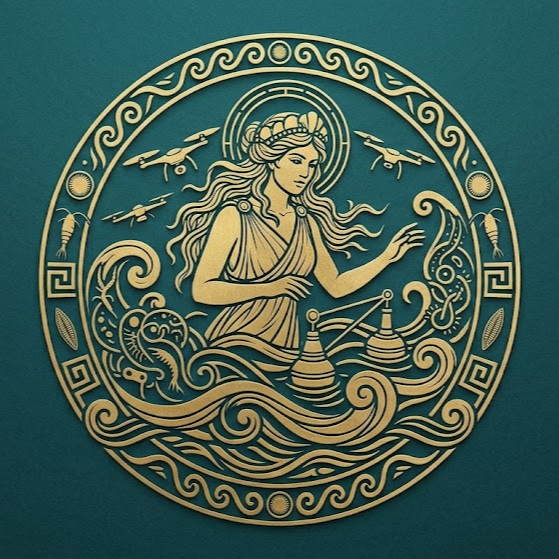

# NEREID
### *An AI-driven ecosystem using satellite data and drone swarms to deploy bioremediation buoys for autonomous microplastic tracking and elimination in the Mediterranean Sea.*

 

---

## The Problem
The Mediterranean faces a severe microplastic crisis, acting as a retention trap for an estimated 730 tonnes of plastic waste every day [1]. Current monitoring is largely reactive; vessels are dispatched only after visible accumulation occurs, wasting fuel and time. Furthermore, autonomous marine devices are limited by finite battery life, making them expensive to service and prone to failure in harsh, open-water conditions. There is a critical gap between identifying where plastic is and efficiently getting collection hardware to that exact location.

## Target Group
Coastal municipalities, port authorities, and marine protected areas benefit directly from real-time pollution monitoring and autonomous removal, while EU policymakers gain actionable data to support Extended Producer Responsibility (EPR) compliance and evidence-based regulation. Most importantly, local fishing communities whose livelihoods and food safety depend on uncontaminated waters, stand to benefit from our work, giving our mission a deeply human dimension alongside its technological ambition.

## The Solution
NEREID is a fully autonomous, four-layer marine pollution response platform.

* **Intelligence:** Satellite images processed by deep neural networks continuously map the location, extent, and drift of microplastic patches [2].
* **Coordination:** An Optimization Algorithm analyzes the satellite maps to optimally coordinate our fleet in real-time.
* **Deployment:** Drones receive commands from the AI to physically transport and precisely drop sensor-equipped buoys into identified pollution hotspots, eliminating the need for boat dispatch.
* **Action & Energy:** Once deployed, the buoys actively filter microplastics. They are powered by a hybrid system: solar panels supplemented by onboard microbial fuel cells. These cells use electrogenic bacteria to consume dissolved marine pollutants and convert them directly into electricity [3].

## Unique Contribution
We are building the first closed-loop system where intelligence automatically directs logistics without human intervention. By turning the pollution itself into the very energy that powers the cleanup hardware, our buoys become more robust and self-sustaining precisely in the heavily polluted environments where they are needed most.

---

## Financial Sustainability
NEREID ensures long-term viability through three distinct circular blue economy revenue streams. First, Data Licensing: we will provide polymer origin traceability and continuous monitoring data to corporations and governments for EU EPR reporting. Second, Hardware-as-a-Service (HaaS): port authorities and coastal municipalities can lease the autonomous drone and buoy network for localized pollution management. Third, Material Valorisation: the microplastic cartridges collected by the buoys (retrieved via partnerships with local fishers) are integrated directly into the recycled polymer supply chain.

## Acceleration Readiness
We are currently in the early prototype and laboratory validation stage. Our immediate next steps involve training our satellite detection algorithms, validating our multi-agent AI in simulation, and conducting bench tests of the hybrid microbial fuel cells. Within the next 8–12 months, we will assemble the full drone-and-buoy prototypes for tank testing, followed by an operational pilot deployment in the local gulf. We are highly acceleration-ready: we are seeking support to refine our commercial data-licensing model, improve investor readiness, and structure our operations for a follow-on European maritime grant application to scale our network. 

## Motivation
The Plastic Fantastic Hackathon provides the ideal ecosystem to transition NEREID from a conceptual architecture into an actionable prototype. Our goal is to leverage the bootcamp's mentorship to refine our commercialization strategy, particularly regarding municipal partnerships and EPR data monetization. We aim to connect with domain experts in blue economy innovation, secure initial validation funding to cover our early-stage simulation and lab testing, and position our organization for larger European deployment grants. We want to prove that Mediterranean pollution response can be predictive, fully autonomous, and energy-positive.

---

## References
**[1]** United Nations Environment Programme (UNEP). (2022). *Assessment of Marine Litter in the Mediterranean Sea.* **[2]** Danilov, A., & Serdiukova, E. (2024). Review of Methods for Automatic Plastic Detection in Water Areas Using Satellite Images and Machine Learning. *Sensors*, 24(16), 5089.  
**[3]** Kwofie, S., et al. (2024). Comprehensive Analysis of Clean Energy Generation in Microbial Fuel Cells. *International Journal of Energy Research.*  

  <i>Submitted to the PLASTIC FANTASTIC Hackathon – Track B (Emerging Organisations)</i>  
  <b>Contact:</b> Lydia Gialama | <a href="mailto:l.gialama@athenarc.gr">l.gialama@athenarc.gr</a> | <a href="https://www.linkedin.com/in/lydia-gialama-5024ba260" target="_blank">LinkedIn</a>

